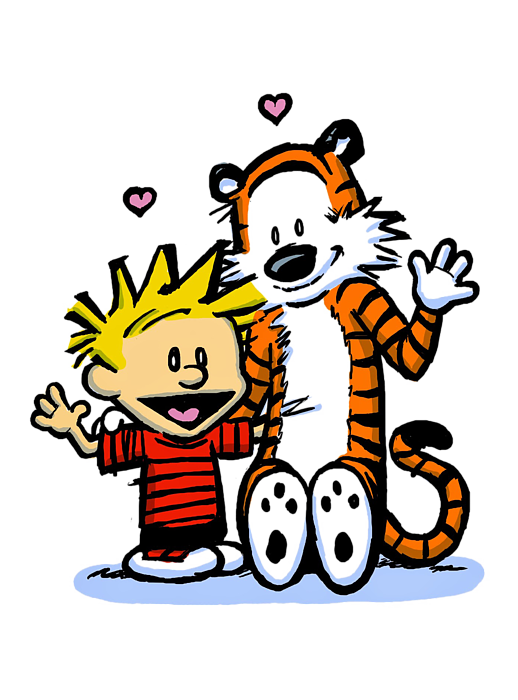

% My slide
% Me
% 2024-01-24

---

# First slide

- Cool item
- _With_ **things**
- And inline `code`

---

# Second slide

1. [Linked](http://www.link.com) item
2. Some emojis ✔️
3. Not all though :/

---

# Third slide

Code zeit.

```haskell
data Maybe a = Yes a | No
```

---

# Fourth slide

::: columns

:::: column

{height=50%}

::::

:::: column

- Bye
- Bye
- Bye
- Bye
- Bye
- Bye
- Bye
- Bye

::::

:::
